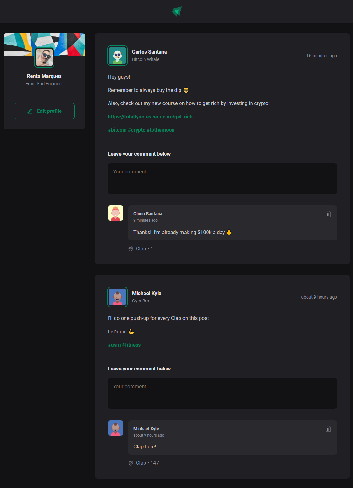

<h1 align="center">
  <br/>
  
  <br/><br/>
  <div>
    
    
    
    
    
  </div>
</h1>

## ✨ Description

This app is a fake social feed with posts and commets created to practice the fundamentals of ReactJS like components, properties, states, immutability and hooks. Developed during the "Ignite - ReactJS" bootcamp by [@Rocketseat](https://www.rocketseat.com.br).

## 🚀 Technologies
-  React
-  Vite
-  CSS Modules
-  date-fns
-  Phosphor icons

## 💻 Installation

After cloning/downloading this repository, open your terminal, navigate to the project's folder and run:

```cl
  npm install
  npm run dev
```

## 🌟 Preview


